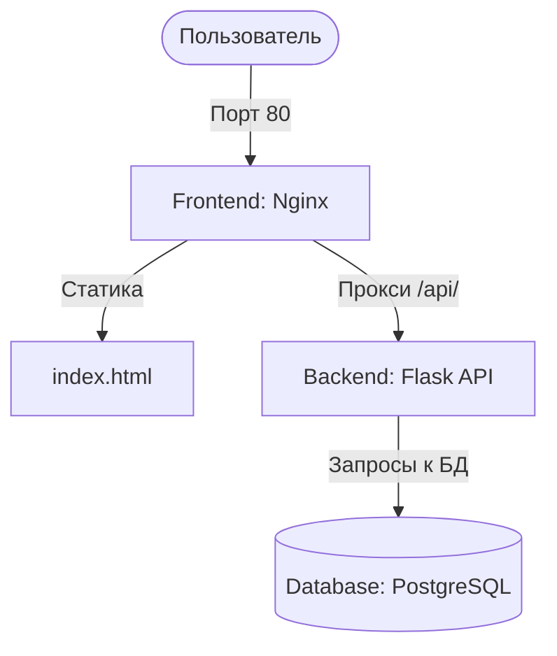

# Лабораторная работа 1: Docker + Docker Compose + Git

Контейнеризация веб-приложения с базой данных и деплой через Git.

## Архитектура проекта

Проект представляет собой трехкомпонентное веб-приложение, упакованное в Docker-контейнеры и оркеструемое с помощью Docker Compose:
1. **Frontend (Nginx)**: веб-сервер, который раздает статический HTML-интерфейс и проксирует API-запросы на бэкенд. Единственная точка входа, открытая наружу.
2. **Backend (Python/Flask API)**: REST API сервис для управления списком задач (CRUD).
3. **Database (PostgreSQL)**: база данных для персистентного хранения задач.



---

## Запуск проекта

### Требования
* Docker (20.10+)
* Docker Compose (2.0+)

### Инструкция
1. Скопируйте файл переменных окружения:
   ```bash
   cp .env.example .env
   ```
2. Отредактируйте `.env`, установив безопасный пароль для базы данных.
3. Запустите стек контейнеров:
   ```bash
   docker compose up -d --build
   ```
4. Откройте приложение в браузере по адресу: [http://localhost](http://localhost)

---

## Переменные окружения (`.env`)

* `POSTGRES_DB` — имя базы данных (по умолчанию `taskdb`).
* `POSTGRES_USER` — пользователь базы данных (по умолчанию `appuser`).
* `POSTGRES_PASSWORD` — пароль для подключения к базе данных.

---

## Полезные команды

* **Сборка и запуск в фоновом режиме**:
  ```bash
  docker compose up -d --build
  ```
* **Остановка контейнеров**:
  ```bash
  docker compose down
  ```
* **Просмотр статуса сервисов**:
  ```bash
  docker compose ps
  ```
* **Просмотр логов бэкенда**:
  ```bash
  docker compose logs -f backend
  ```
* **Вход в контейнер бэкенда**:
  ```bash
  docker compose exec backend sh
  ```
* **Вход в базу данных**:
  ```bash
  docker compose exec postgres psql -U appuser -d taskdb
  ```

---

## Ответ на вопрос: Что произойдет при `docker compose down -v`?

Команда `docker compose down -v` останавливает и удаляет контейнеры, сети, а также **удаляет все ассоциированные с проектом тома (volumes)**.

* **Почему это происходит**: Флаг `-v` (или `--volumes`) явно указывает Docker удалить именованные и анонимные тома, описанные в секции `volumes` файла `docker-compose.yml`.
* **Последствия**: База данных PostgreSQL хранит свои данные в томе. При удалении этого тома вся накопленная информация (список созданных задач) будет **безвозвратно удалена**.
